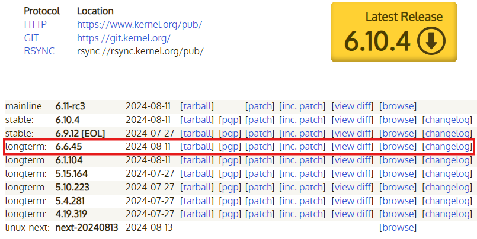
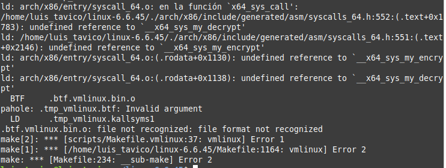
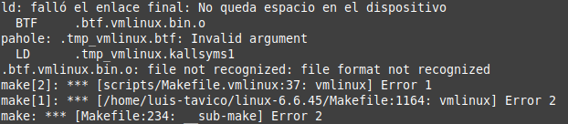

# INSTALACION Y MODIFICACION DE KERNEL

# Pasos seguidos

A continuacion se detalla cada uno de los pasos seguidos para la instalacion y modificacion del kernel.

## Actualizar repositorios

Primero es necesario actualizar todos los paquetes instalados, para no tener algun problema de compatibilidad.

```
$ sudo apt update
$ sudo apt upgrade
```

## Instalar dependencias

Luego necesitamos instalar algunos paquetes necesarios para la compilacion.

```
$ sudo apt install build-essential libncurses-dev bison flex libssl-dev libelf-dev fakeroot dwarves
```

## Descargar y descomprimir el kernel

A continuacion, debemos descargar el codigo fuente del kernel desde el sitio web oficial [kernel.org](https://kernel.org/). Usaremos la version ```longterm``` mas reciente del kernel.



Copiamos la direccion del vinculo ```tarball```. Luego usamos este enlace para descargar y descomprimir la fuente del kernel.

```
$ wget https://cdn.kernel.org/pub/linux/kernel/v6.x/linux-6.6.45.tar.xz
$ tar -xf linux-6.6.45.tar.xz
```

## Modificar el kernel

### Mensaje personalizado

Agregaremos un mensaje personalizado al registro de inicio del kernel que de la bienvenida al usuario cuando se inicie el kernel para ello primero ingresamos al siguiente directorio:

```
$ cd linux-6.6.45/init/
```

Luego buscamos el archivo ```main.c``` y agregamos la siguiente linea de codigo en el archivo.

```
pr_notice("Bienvenido a USAC Linux - Nombre: Pedro Luis Pu Tavico, Carnet: 202000562\n");
```

### Nombre personalizado

Modificaremos el nombre del kernel mostrado por uname a “USAC Linux” para ello primero ingresamos al siguiente directorio:

```
$ cd linux-6.6.45/include/linux/
```

Luego buscamos el archivo ```uts.h``` y modoficamos la siguiente linea de codigo:

```
#define UTS_SYSNAME "Linux"
```

por:

```
#define UTS_SYSNAME "USAC Linux"
```

### Llamadas al Sistema

#### Hora actual

Agregaremos una nueva llamada al sistema que devuelva la hora actual en segundos desde el epoch linux. para ello primero ingresamos al siguiente directorio: 

```
$ cd linux-6.6.45/kernel/
```

Ahora creamos un nuevo archivo llamado ```get_current_time.c```.

```
$ touch get_current_time.c
```

El contenido del archivo sera lo siguiente:

```
#include <linux/kernel.h>
#include <linux/syscalls.h>
#include <linux/timekeeping.h>

SYSCALL_DEFINE0(get_current_time)
{
    unsigned long epoch_time = ktime_get_real_seconds();
    return epoch_time;
}
```

#### Tiempo actividad

Agregaremos una llamada al sistema que devuelva el tiempo de actividad del sistema en segundos desde el ultimo reinicio, para ello primero ingresamos al siguiente directorio: 

```
$ cd linux-6.6.45/kernel/
```

Ahora creamos un nuevo archivo llamado ```get_system_uptime.c```.

```
$ touch get_system_uptime.c
```

El contenido del archivo sera lo siguiente:

```
#include <linux/kernel.h>
#include <linux/syscalls.h>
#include <linux/timekeeping.h>

SYSCALL_DEFINE0(get_system_uptime)
{
    unsigned long uptime = ktime_get_boottime_seconds();
    return uptime;
}
```

### Registrar Llamadas al Sistema

Registraremos las llamadas al sistema realizadas anteriormente en la tabla de llamadas del sistema, para ello primero ingresamos al siguiente directorio: 

```
$ cd linux-6.6.45/arch/x86/entry/syscalls/
```

Luego buscamos el archivo ```syscall_64.tbl``` y agregamos la siguientes lineas de codigo al final del archivo.

```
548 common  get_current_time    sys_get_current_time
549 common  get_system_uptime   sys_get_system_uptime
550 common  sys_my_encrypt      sys_my_encrypt
551 common  sys_my_decrypt      sys_my_decrypt
```

Ahora agregamos las declaraciones de las nuevas llamadas al sistema, entonces ingresamos al siguiente directorio: 

```
$ cd linux-6.6.45/include/linux/
```

Luego buscamos el archivo ```syscalls.h``` y agregamos la siguientes lineas de codigo al final del archivo.

```
asmlinkage long sys_get_current_time(void);
asmlinkage long sys_get_system_uptime(void);
```

Por ultimo debemos generar los archivos objeto, para ello ingresamos al siguiente directorio:

```
$ cd linux-6.6.45/kernel/
```

Ahora buscamos el archivo ```Makefile``` y agregamos la siguientes lineas de codigo:

```
obj-y += get_current_time.o
obj-y += get_system_uptime.o
```

## Crear achivo de prueba

Para verificar que las llamadas al sistema funcionen bien, se procede a realizar un archivo de prueba que ejecute las llamadas al sistema creadas, para ello primero debemos crear un archivo lo nombraremos ```test_syscalls```.

```
$ touch test_syscalls.c
```

Luego agregamos el siguiente bloque de codigo:

```
#include <stdio.h>
#include <unistd.h>
#include <sys/syscall.h>

#define SYSCALL_CURRENT_TIME 548
#define SYSCALL_SYSTEM_UPTIME 549

#define BUFFER_SIZE 10120

void test_current_time() {
    long result = syscall(SYSCALL_CURRENT_TIME);
    if (result >= 0) {
        printf("Tiempo actual desde el epoch: %ld segundos.\n", result);
    } else {
        printf("Error al obtener el tiempo actual desde el epoch.\n");
    }
}

void test_system_uptime() {
    long result = syscall(SYSCALL_SYSTEM_UPTIME);
    if (result >= 0) {
        printf("Tiempo de actividad del sistema desde el ultimo reinicio: %ld segundos.\n", result);
    } else {
        printf("Error al obtener el tiempo de actividad del sistema.\n");
    }
}

int main() {
    printf("***************************************************************************\n");
    test_current_time();
    printf("***************************************************************************\n");
    test_system_uptime();
    return 0;
}
```

Ahora debemos compilar el archivo creado, entonces ejecutamos el siguiente comando:

```
$ gcc -o test_syscalls test_syscalls.c
```

Despues de compilar podemos ejecutar el programa para probar las nuevas llamadas al sistema con el siguiente comando:

```
$ ./test_syscalls
```

## Configurar el kernel

Primero ingrasamos al directorio del codigo fuente.

```
$ cd linux-6.6.45
```

La configuracion del kernel se debe especificar en un archivo .config. Para no escribir este desde 0 vamos a copiar el archivo de configuracion del Linux actualmente instalado.

```
$ cp -v /boot/config-$(uname -r) .config
```

Sin embargo, este esta lleno de modulos y drivers que no necesitamos que pueden aumentar el tiempo de compilación. Por lo que utilizamos el comando ```localmodconfig``` que analiza los módulos del kernel cargados del sistema y modifica el archivo .config de modo que solo estos modulos se incluyan en la compilacion.

```
$ make localmodconfig
```

Luego tenemos que modificar el .config, ya que al copiar nuestro .config se incluyeron nuestras llaves privadas, por lo que tendremos que reliminarlas del .config.

```
$ scripts/config --disable SYSTEM_TRUSTED_KEYS
$ scripts/config --disable SYSTEM_REVOCATION_KEYS
$ scripts/config --set-str CONFIG_SYSTEM_TRUSTED_KEYS ""
$ scripts/config --set-str CONFIG_SYSTEM_REVOCATION_KEYS ""
```

## Compilar el kernel

Ahora es el momento de compilar el kernel. Para esto simplemente ejecutamos el comando:

```
$ fakeroot make -j4
```

Donde ```-j4``` es la cantidad de nucleos que se deseamos utilizar para compilar el kernel.

Utilizar ```fakeroot``` es necesario por que nos permite ejecutar el comando ```make``` en  un  entorno  donde  parece  que  se  tiene  permisos  de superusuario  para  la  manipulacion  de  ficheros.  Es necesario  para  permitir a este comando crear archivos (tar, ar, .deb etc.) con ficheros con permisos/propietarios de superusuario.

## Instalar el kernel

La instalacion se divide en dos partes: instalar los modulos del kernel e instalar el kernel mismo.

Primero se instalan los modulos del kernel ejecutando:

```
$ sudo make modules_install
```

Luego instalamos el kernel ejecutando:

```
$ sudo make install
```

Despues de eso, reiniciamos la computadora para que se complete la instalacion.

```
$ sudo reboot
```

Ahora hemos terminado de instalar el kernel con los cambios necesarios.

# Errores ocurridos

A continuacion se detalla cada uno de los errores que ocurrieron durante la instalacion y modificacion del kernel.

## Falta de memoria RAM

Este error ocurrio debido a que el sistema se quedo sin memoria o recursos y por lo tanto el proceso de compilacion fallo.



Para solucionar este error se debe aumentar el tamaño de la memoria RAM de la maquina virtual en la que se esta trabajando.


## Falta de espacio

Este error ocurrio debido a la falta de espacio en el dispositivo y por lo tanto el proceso de compilacion fallo.



La causa de este error se debe a que anteriormente se realizaron varias compilaciones y esto provoco que archivos temporales ocuparan demasiado espacio.

Para solucionar este error se ejecuto el siguiente comando:

```
make clean
```

Este comando se encargar de limpiar el espacio de trabajo usado.

## Funcion no compila

Para solucionar este error se debe ingresar al siguiente directorio:

```
$ cd linux-6.6.45/kernel/
```

Luego debemos agregar la llamada a las funciones en el archivo ```Makefile```, esto forzara al kernel a compilar las funciones nuevas.