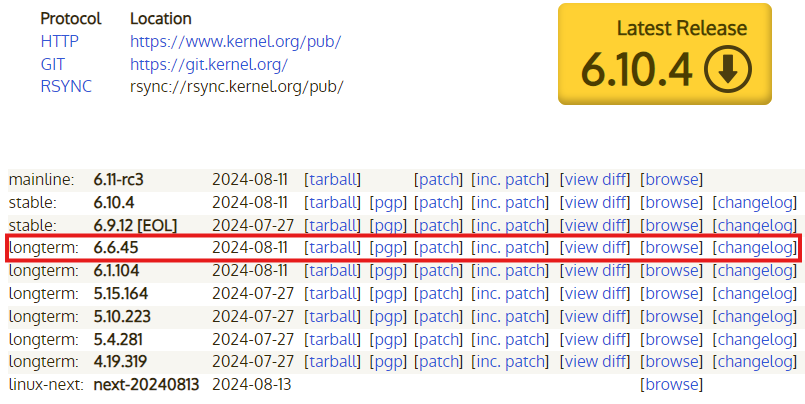
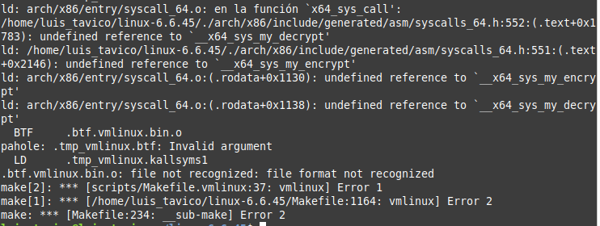

# INSTALACION Y MODIFICACION DE KERNEL

# Pasos seguidos

A continuacion se detalla cada uno de los pasos seguidos para la instalacion y modificacion del kernel.

## Actualizar repositorios

Primero es necesario actualizar todos los paquetes instalados, para no tener algun problema de compatibilidad.

```
$ sudo apt update
$ sudo apt upgrade
```

## Instalar dependencias

Luego necesitamos instalar algunos paquetes necesarios para la compilacion.

```
$ sudo apt install build-essential libncurses-dev bison flex libssl-dev libelf-dev fakeroot dwarves
```

## Descargar y descomprimir el kernel

A continuacion, debemos descargar el codigo fuente del kernel desde el sitio web oficial [kernel.org](https://kernel.org/). Usaremos la version ```longterm``` mas reciente del kernel.



Copiamos la direccion del vinculo ```tarball```. Luego usamos este enlace para descargar y descomprimir la fuente del kernel.

```
$ wget https://cdn.kernel.org/pub/linux/kernel/v6.x/linux-6.6.54.tar.xz
$ tar -xf linux-6.6.54.tar.xz
```

## Modificar el kernel

### Llamadas al Sistema

Se crearon llamadas al sistema que recojen informacion detallada del uso de memoria desde el kernel.
Estas llamadas proporcionan la siguiente informacion:
* Uso de memoria: Memoria libre, utilizada y en caché.
* Páginas de memoria de swap usadas y libres: Esta llamada al sistema recupera el número de
páginas de swap libres y utilizadas.
* Cantidad de fallos de página: Esta llamada al sistema devuelve el número total de fallos de página, divididos en fallos de página menores y mayores desde el inicio del sistema.
* Páginas de memoria activas e inactivas: Esta llamada al sistema proporciona el número de
páginas de memoria activas e inactivas en el sistema.
* Procesos que más memoria utilizan: Esta llamada al sistema recupera información sobre los 5 procesos que consumen más memoria en el sistema.

Para ello primero ingresamos al siguiente directorio: 

```
$ cd linux-6.6.54/kernel/
```

Ahora al archivo ```sys.c``` le agremos los siguientes bloques de codigo:

```
SYSCALL_DEFINE3(obtener_info_memoria, unsigned long __user *, memoria_libre, unsigned long __user *, memoria_usada, unsigned long __user *, memoria_cacheada) {
    struct sysinfo info_memoria;
    struct file *archivo_meminfo;
    char *buffer_lectura;
    unsigned long total_memoria, libre_memoria, cacheada_memoria, usada_memoria;
    loff_t posicion = 0;
    ssize_t tamano_lectura;

    // Obtener estadísticas del sistema sobre la memoria
    si_meminfo(&info_memoria);

    total_memoria = info_memoria.totalram * info_memoria.mem_unit;
    libre_memoria = info_memoria.freeram * info_memoria.mem_unit;

    // Inicialmente cacheamos usando bufferram, pero obtendremos más datos de /proc/meminfo
    cacheada_memoria = info_memoria.bufferram * info_memoria.mem_unit;

    // Asignar espacio para el buffer de lectura
    buffer_lectura = kzalloc(256, GFP_KERNEL);
    if (!buffer_lectura) {
        return -ENOMEM;
    }

    // Leer información detallada desde /proc/meminfo
    archivo_meminfo = filp_open("/proc/meminfo", O_RDONLY, 0);
    if (IS_ERR(archivo_meminfo)) {
        kfree(buffer_lectura);
        return PTR_ERR(archivo_meminfo);
    }

    tamano_lectura = kernel_read(archivo_meminfo, buffer_lectura, 255, &posicion);
    filp_close(archivo_meminfo, NULL);

    if (tamano_lectura < 0) {
        kfree(buffer_lectura);
        return -EFAULT;
    }

    // Buscar "Cached:" en el archivo leído
    char *cadena_cacheada = strstr(buffer_lectura, "Cached:");
    if (cadena_cacheada) {
        sscanf(cadena_cacheada, "Cached: %lu kB", &cacheada_memoria);
        cacheada_memoria *= 1024;  // Conversión de KB a bytes
    }

    usada_memoria = total_memoria - libre_memoria - cacheada_memoria;

    // Liberar el buffer
    kfree(buffer_lectura);

    // Pasar los valores al espacio de usuario
    if (copy_to_user(memoria_libre, &libre_memoria, sizeof(libre_memoria)) ||
        copy_to_user(memoria_usada, &usada_memoria, sizeof(usada_memoria)) ||
        copy_to_user(memoria_cacheada, &cacheada_memoria, sizeof(cacheada_memoria))) {
        return -EFAULT;
    }

    return 0;  // Operación exitosa
}

SYSCALL_DEFINE2(obtener_info_swap, unsigned long __user *, swap_libre, unsigned long __user *, swap_usada) {
    unsigned long total_swap = total_swap_pages;
    unsigned long libre_swap = get_nr_swap_pages();

    unsigned long usada_swap = total_swap - libre_swap;

    if (copy_to_user(swap_libre, &libre_swap, sizeof(libre_swap)) ||
        copy_to_user(swap_usada, &usada_swap, sizeof(usada_swap))) {
        return -EFAULT;
    }

    return 0;
}

SYSCALL_DEFINE2(obtener_fallos_pagina, unsigned long __user *, fallos_menores, unsigned long __user *, fallos_mayores) {
    unsigned long fallos_min = global_node_page_state(PGFAULT);    // Fallos menores
    unsigned long fallos_maj = global_node_page_state(PGMAJFAULT); // Fallos mayores

    if (copy_to_user(fallos_menores, &fallos_min, sizeof(fallos_min)) ||
        copy_to_user(fallos_mayores, &fallos_maj, sizeof(fallos_maj))) {
        return -EFAULT;
    }

    return 0;
}

SYSCALL_DEFINE2(obtener_paginas_act_inact, unsigned long __user *, paginas_activas, unsigned long __user *, paginas_inactivas) {
    unsigned long activas = global_node_page_state(NR_ACTIVE_ANON) + global_node_page_state(NR_ACTIVE_FILE);
    unsigned long inactivas = global_node_page_state(NR_INACTIVE_ANON) + global_node_page_state(NR_INACTIVE_FILE);

    if (copy_to_user(paginas_activas, &activas, sizeof(activas)) ||
        copy_to_user(paginas_inactivas, &inactivas, sizeof(inactivas))) {
        return -EFAULT;
    }

    return 0;
}

#define MAX_PROCESOS 5
#define LONGITUD_NOMBRE 16

// Estructura auxiliar para almacenar los datos del proceso
struct info_proceso {
    pid_t pid;
    unsigned long uso_memoria;
    char nombre[LONGITUD_NOMBRE];
};

SYSCALL_DEFINE3(obtener_procesos_memoria, pid_t __user *, pids, unsigned long __user *, uso_memorias, char __user *, nombres_procesos) {
    struct task_struct *proceso;
    struct info_proceso procesos_top[MAX_PROCESOS] = { {0, 0, ""}, {0, 0, ""}, {0, 0, ""}, {0, 0, ""}, {0, 0, ""} };
    int i, j;
    unsigned long memoria_proceso;

    // Iterar sobre la lista de procesos para identificar los de mayor consumo
    rcu_read_lock();
    for_each_process(proceso) {
        if (proceso->mm) {
            memoria_proceso = get_mm_rss(proceso->mm) << PAGE_SHIFT;

            // Comparar con los procesos que ya están en la lista
            for (i = 0; i < MAX_PROCESOS; i++) {
                if (memoria_proceso > procesos_top[i].uso_memoria) {
                    // Desplazar los procesos con menos memoria hacia abajo
                    for (j = MAX_PROCESOS - 1; j > i; j--) {
                        procesos_top[j] = procesos_top[j-1];
                    }
                    // Insertar el proceso en la posición correcta
                    procesos_top[i].pid = proceso->pid;
                    procesos_top[i].uso_memoria = memoria_proceso;
                    strncpy(procesos_top[i].nombre, proceso->comm, LONGITUD_NOMBRE);
                    break;
                }
            }
        }
    }
    rcu_read_unlock();

    // Copiar la información al espacio de usuario
    for (i = 0; i < MAX_PROCESOS; i++) {
        if (copy_to_user(&pids[i], &procesos_top[i].pid, sizeof(pid_t)) ||
            copy_to_user(&uso_memorias[i], &procesos_top[i].uso_memoria, sizeof(unsigned long)) ||
            copy_to_user(&nombres_procesos[i * LONGITUD_NOMBRE], procesos_top[i].nombre, LONGITUD_NOMBRE)) {
            return -EFAULT;
        }
    }

    return 0;
}
```

### Registrar Llamadas al Sistema

Registraremos las llamadas al sistema realizadas anteriormente en la tabla de llamadas del sistema, para ello primero ingresamos al siguiente directorio: 

```
$ cd linux-6.6.54/arch/x86/entry/syscalls/
```

Luego buscamos el archivo ```syscall_64.tbl``` y agregamos la siguientes lineas de codigo al final del archivo.

```
454	64	obtener_info_memoria		sys_obtener_info_memoria
455	64	obtener_info_swap		    sys_obtener_info_swap
456	64	obtener_fallos_pagina		sys_obtener_fallos_pagina
457	64	obtener_paginas_act_inact	sys_obtener_paginas_act_inact
458	64	obtener_procesos_memoria	sys_obtener_procesos_memoria
```

Ahora agregamos las declaraciones de las nuevas llamadas al sistema, entonces ingresamos al siguiente directorio: 

```
$ cd linux-6.6.54/include/linux/
```

Luego crearemos un archivo el cual nombraremos ```syscalls_usac.h``` y agregamos la siguientes lineas de codigo al archivo.

```
#ifndef _SYSCALLS_USAC_H
#define _SYSCALLS_USAC_H

#include <linux/kernel.h>
#include <linux/syscalls.h>

asmlinkage long obtener_info_memoria(unsigned long *memoria_libre, unsigned long *memoria_usada, unsigned long *memoria_cacheada);
asmlinkage long obtener_info_swap(unsigned long *swap_libre, unsigned long *swap_usada);
asmlinkage long obtener_fallos_pagina(unsigned long *fallos_menores, unsigned long *fallos_mayores);
asmlinkage long obtener_paginas_act_inact(unsigned long *paginas_activas, unsigned long *paginas_inactivas);
asmlinkage long obtener_procesos_memoria(pid_t __user *pids, unsigned long __user *uso_memorias, char __user *nombres_procesos);

#endif
```

## Crear espacio de usuario

### Crear API

Crearemos un programa en espacio de usuario que actúe como un intermediario entre el kernel y el dashboard web. Este programa hará las llamadas al sistema para obtener la información de memoria y luego enviará los datos a un servidor web.
Este programa esta escrito en C, interactuando con el kernel mediante las llamadas al sistema creadas, y luego transformando esos datos en JSON para que pueda ser enviado al dashboard por medio
de llamadas HTTP.

Al programa lo nombraremos ```app``` y para crerlo hacemos lo siguiente.

```
$ touch app.c
```

Luego agregamos el siguiente bloque de codigo:

```
#include <stdio.h>
#include <stdlib.h>
#include <unistd.h>
#include <sys/syscall.h>
#include <string.h>
#include <errno.h>
#include <sys/types.h>
#include <sys/socket.h>
#include <netinet/in.h>
#include <cjson/cJSON.h>

#define PORT 8080
#define TOP_PROCESSES 5
#define TASK_COMM_LEN 16

#define SYS_obtener_info_memoria        454
#define SYS_obtener_info_swap           455
#define SYS_obtener_fallos_pagina       456
#define SYS_obtener_paginas_act_inact   457
#define SYS_obtener_procesos_memoria    458

void get_memory_info(unsigned long *memoria_libre, unsigned long *memoria_usada, unsigned long *memoria_cacheada) {
    long result = syscall(SYS_obtener_info_memoria, memoria_libre, memoria_usada, memoria_cacheada);
    if (result != 0) {
        perror("Error getting memory info");
    }
}

void get_swap_info(unsigned long *swap_libre, unsigned long *swap_usada) {
    long result = syscall(SYS_obtener_info_swap, swap_libre, swap_usada);
    if (result != 0) {
        perror("Error getting swap info");
    }
}

void get_page_faults(unsigned long *fallos_menores, unsigned long *fallos_mayores) {
    long result = syscall(SYS_obtener_fallos_pagina, fallos_menores, fallos_mayores);
    if (result != 0) {
        perror("Error getting page faults");
    }
}

void get_act_inact_pages(unsigned long *paginas_activas, unsigned long *paginas_inactivas) {
    long result = syscall(SYS_obtener_paginas_act_inact, paginas_activas, paginas_inactivas);
    if (result != 0) {
        perror("Error getting active/inactive pages");
    }
}

void get_memory_processes(pid_t pids[], unsigned long mem_usage[], char names[][TASK_COMM_LEN]) {
    long result = syscall(SYS_obtener_procesos_memoria, pids, mem_usage, names);
    if (result != 0) {
        perror("Error getting memory processes");
    }
}

void send_json_response(int client_socket) {
    unsigned long memoria_libre, memoria_usada, memoria_cacheada;
    unsigned long swap_libre, swap_usada;
    unsigned long fallos_menores, fallos_mayores;
    unsigned long paginas_activas, paginas_inactivas;
    pid_t pids[TOP_PROCESSES];
    unsigned long mem_usage[TOP_PROCESSES];
    char names[TOP_PROCESSES][TASK_COMM_LEN];

    // Llamadas a las syscalls
    get_memory_info(&memoria_libre, &memoria_usada, &memoria_cacheada);
    get_swap_info(&swap_libre, &swap_usada);
    get_page_faults(&fallos_menores, &fallos_mayores);
    get_act_inact_pages(&paginas_activas, &paginas_inactivas);
    get_memory_processes(pids, mem_usage, names);

    // Crear el JSON
    cJSON *json = cJSON_CreateObject();

    // Información de memoria
    cJSON *memory_info = cJSON_CreateObject();
    cJSON_AddNumberToObject(memory_info, "free", memoria_libre);
    cJSON_AddNumberToObject(memory_info, "used", memoria_usada);
    cJSON_AddNumberToObject(memory_info, "cached", memoria_cacheada);
    cJSON_AddItemToObject(json, "memoryInfo", memory_info);

    // Información de swap
    cJSON *swap_info = cJSON_CreateObject();
    cJSON_AddNumberToObject(swap_info, "free", swap_libre);
    cJSON_AddNumberToObject(swap_info, "used", swap_usada);
    cJSON_AddItemToObject(json, "swapInfo", swap_info);

    // Fallos de página
    cJSON *page_faults = cJSON_CreateObject();
    cJSON_AddNumberToObject(page_faults, "minors", fallos_menores);
    cJSON_AddNumberToObject(page_faults, "majors", fallos_mayores);
    cJSON_AddItemToObject(json, "pageFaults", page_faults);

    // Páginas activas/inactivas
    cJSON *active_inactive_pages = cJSON_CreateObject();
    cJSON_AddNumberToObject(active_inactive_pages, "active", paginas_activas);
    cJSON_AddNumberToObject(active_inactive_pages, "inactive", paginas_inactivas);
    cJSON_AddItemToObject(json, "activeInactivePages", active_inactive_pages);

    // Procesos con mayor uso de memoria
    cJSON *processes = cJSON_CreateArray();
    for (int i = 0; i < TOP_PROCESSES; i++) {
        cJSON *process = cJSON_CreateObject();
        cJSON_AddNumberToObject(process, "pid", pids[i]);
        cJSON_AddStringToObject(process, "name", names[i]);
        cJSON_AddNumberToObject(process, "memoryUsage", mem_usage[i]);
        cJSON_AddItemToArray(processes, process);
    }
    cJSON_AddItemToObject(json, "topProcesses", processes);

    // Convertir JSON a cadena
    char *json_string = cJSON_Print(json);

    // Enviar la respuesta HTTP con el encabezado correcto
    const char *header = "HTTP/1.1 200 OK\r\nContent-Type: application/json\r\nAccess-Control-Allow-Origin: *\r\n\r\n";
    send(client_socket, header, strlen(header), 0);
    send(client_socket, json_string, strlen(json_string), 0);

    // Liberar memoria
    free(json_string);
    cJSON_Delete(json);
}

int main() {
    int server_socket, client_socket;
    struct sockaddr_in server_addr, client_addr;
    socklen_t addr_size = sizeof(client_addr);

    // Crear el socket
    server_socket = socket(AF_INET, SOCK_STREAM, 0);
    if (server_socket < 0) {
        perror("Error creating socket");
        return 1;
    }

    // Configurar la dirección del servidor
    server_addr.sin_family = AF_INET;
    server_addr.sin_addr.s_addr = INADDR_ANY;
    server_addr.sin_port = htons(PORT);

    // Enlazar el socket
    if (bind(server_socket, (struct sockaddr*)&server_addr, sizeof(server_addr)) < 0) {
        perror("Error binding socket");
        close(server_socket);
        return 1;
    }

    // Escuchar conexiones entrantes
    if (listen(server_socket, 10) < 0) {
        perror("Error listening");
        close(server_socket);
        return 1;
    }

    printf("Server listening on port %d\n", PORT);

    while (1) {
        client_socket = accept(server_socket, (struct sockaddr*)&client_addr, &addr_size);
        if (client_socket < 0) {
            perror("Error accepting connection");
            continue;
        }

        send_json_response(client_socket);
        close(client_socket);
    }

    close(server_socket);
    return 0;
}
```

Ahora debemos compilar el archivos creado, entonces ejecutamos el siguiente comando:

```
$ gcc -o app app.c
```

Despues de compilar podemos ejecutar el programa con el siguiente comando:

```
$ ./app
```

El archivo devolvera los datos obtenidos de las llamadas al sistema en formato json tal como se muestra en el siguiente ejemplo:

```
{
	"memoryInfo":	{
		"free":	1605672960,
		"used":	3474001920,
		"cached":	1088667648
	},
	"swapInfo":	{
		"free":	420416,
		"used":	103871
	},
	"pageFaults":	{
		"minors":	16933,
		"majors":	0
	},
	"activeInactivePages":	{
		"active":	177540,
		"inactive":	470811
	},
	"topProcesses":	[{
			"pid":	5416,
			"name":	"node",
			"memoryUsage":	390553600
		}, {
			"pid":	2699,
			"name":	"code",
			"memoryUsage":	243548160
		}, {
			"pid":	5215,
			"name":	"chrome",
			"memoryUsage":	211554304
		}, {
			"pid":	3603,
			"name":	"chrome",
			"memoryUsage":	193298432
		}, {
			"pid":	5670,
			"name":	"code",
			"memoryUsage":	153034752
		}]
}
```

## Crear frontend

### Crear dashboard

El dashboard web es la una interfaz gráfica que mostrará información en tiempo real sobre el uso de memoria del sistema. 

Para ello crearemos una aplicacion web usando react.

```
npx create ...
```

En el archivo App.js

```
import './App.css';
import React, { useState, useEffect } from 'react';
import axios from 'axios';
import MemoryPieChart from './components/MemoryPieChart';
import MemoryLineChart from './components/MemoryLineChart';
import PageFaultChart from './components/PageFaultChart';
import ActiveInactivePagesPie from './components/ActiveInactivePagesPie';
import TopProcessesTable from './components/TopProcessesTable';

function App() {
  const [memoryData, setMemoryData] = useState(null);

  useEffect(() => {
    const fetchMemoryData = async () => {
      try {
        const response = await axios.get('http://127.0.0.1:8080');
        setMemoryData(response.data);
      } catch (error) {
        console.error("Error fetching memory data:", error);
      }
    };
    fetchMemoryData();
    const intervalId = setInterval(fetchMemoryData, 1000);
    return () => clearInterval(intervalId);
  }, []);

  if (!memoryData) {
    return <div className="text-center mt-5">Cargando datos...</div>;
  }

  return (
    <div className="container mt-4">
      <h1 className="text-center mb-5">Monitoreo Avanzado De Memoria</h1>
      <div className="row">
        <div className="col-md-6">
          <div className="card mb-4">
            <div className="card-body">
              <h5 className="card-title text-center">Desglose Del Uso De La Memoria</h5>
              <MemoryPieChart memoryInfo={memoryData.memoryInfo} />
            </div>
          </div>
        </div>
        <div className="col-md-6">
          <div className="card mb-4">
            <div className="card-body">
              <h5 className="card-title text-center">Memoria Usada A Lo Largo Del Tiempo</h5>
              <MemoryLineChart swapInfo={memoryData.swapInfo} />
            </div>
          </div>
        </div>
      </div>
      <div className="row">
        <div className="col-md-6">
          <div className="card mb-4">
            <div className="card-body">
              <h5 className="card-title text-center">Tasa De Fallos De Página</h5>
              <PageFaultChart pageFaults={memoryData.pageFaults} />
            </div>
          </div>
        </div>
        <div className="col-md-6">
          <div className="card mb-4">
            <div className="card-body">
              <h5 className="card-title text-center">Páginas Activas Vs Inactivas</h5>
              <ActiveInactivePagesPie activeInactivePages={memoryData.activeInactivePages} />
            </div>
          </div>
        </div>
      </div>
      <div className="row">
        <div className="col-md-12">
          <div className="card mb-4">
            <div className="card-body">
              <h5 className="card-title text-center">5 Procesos Que Consumen Mas Memoria</h5>
              <TopProcessesTable topProcesses={memoryData.topProcesses} />
            </div>
          </div>
        </div>
      </div>
    </div>    
  );
}

export default App;
```

Creamos una nueva carpeta dentro de la carpeta ```src``` la cual la nombraremos ```components```. Luego dentro de la carpeta nueva, creamos 5 archivos con el siguiente bloque de codigo: 

ActiveInactivePagesPie.js
```
import React from 'react';
import { PieChart, Pie, Cell, Tooltip, Legend } from 'recharts';

const COLORS = ['#FF8042', '#0088FE'];

function ActiveInactivePagesPie({ activeInactivePages }) {
  
  const data = [
    { name: 'Paginas Activas',   value: activeInactivePages.active   },
    { name: 'Paginas Inactivas', value: activeInactivePages.inactive },
  ];

  return (
    <PieChart width={450} height={300}>
      <Pie
        data={data}
        cx={245}
        cy={130}
        labelLine={false}
        outerRadius={130}
        fill="#8884d8"
        dataKey="value"
      >
        {data.map((entry, index) => (
          <Cell key={`cell-${index}`} fill={COLORS[index % COLORS.length]} />
        ))}
      </Pie>
      <Tooltip />
      <Legend />
    </PieChart>
  );
}

export default ActiveInactivePagesPie;
```


MemoryLineChart.js
```

import React from 'react';
import { LineChart, Line, XAxis, YAxis, CartesianGrid, Tooltip, Legend, ResponsiveContainer } from 'recharts';

function MemoryLineChart({ swapInfo }) {

  const data = [
    { name: 'Swap Libre', value: swapInfo.free },
    { name: 'Swap Usado', value: swapInfo.used },
  ];

  return (
    <ResponsiveContainer width="100%" height={300}>
      <LineChart data={data}>
        <CartesianGrid strokeDasharray="3 3" />
        <XAxis dataKey="name" />
        <YAxis />
        <Tooltip />
        <Legend />
        <Line 
          type="monotone"
          dataKey="value" 
          name="Cantidad"
          stroke="#8884d8" />
      </LineChart>
    </ResponsiveContainer>
  );
}

export default MemoryLineChart;
```

MemoryPieChart.js
```
import React from 'react';
import { PieChart, Pie, Cell, Tooltip, Legend } from 'recharts';

const COLORS = ['#0088FE', '#00C49F', '#FFBB28'];

function MemoryPieChart({ memoryInfo }) {
  
  const data = [
    { name: 'Memoria Libre', value: memoryInfo.free   },
    { name: 'Memoria Usada', value: memoryInfo.used   },
    { name: 'Memoria cache', value: memoryInfo.cached },
  ];

  return (
    <PieChart width={450} height={300}>
      <Pie
        data={data}
        cx={245}
        cy={130}
        labelLine={false}
        outerRadius={130}
        fill="#8884d8"
        dataKey="value"
      >
        {data.map((entry, index) => (
          <Cell key={`cell-${index}`} fill={COLORS[index % COLORS.length]} />
        ))}
      </Pie>
      <Tooltip />
      <Legend />
    </PieChart>
  );
}

export default MemoryPieChart;
```

PageFaultChart.js
```
import React from 'react';
import { BarChart, Bar, XAxis, YAxis, CartesianGrid, Tooltip, Legend, ResponsiveContainer } from 'recharts';

function PageFaultChart({ pageFaults }) {

  const pageFaultsData = [
    { name: 'Fallos Menores', count: pageFaults.minors },
    { name: 'Fallos Mayores', count: pageFaults.majors },
  ];

  return (
    <ResponsiveContainer width="100%" height={300}>
      <BarChart data={pageFaultsData}>
        <CartesianGrid strokeDasharray="3 3" />
        <XAxis dataKey="name" />
        <YAxis />
        <Tooltip />
        <Legend />
        <Bar 
          dataKey="count"
          name="Cantidad"
          fill="#8884d8" />
      </BarChart>
    </ResponsiveContainer>
  );
}

export default PageFaultChart;
```

TopProcessesTable.js
```
import React from 'react';

function TopProcessesTable({ topProcesses }) {
  return (
    <table className="table table-hover table-Light text-center">
      <thead>
        <tr>
          <th>PID</th>
          <th>Nombre de Proceso</th>
          <th>Memoria Usada (%)</th>
        </tr>
      </thead>
      <tbody>
        {topProcesses.map((process) => (
          <tr key={process.pid}>
            <td>{process.pid}</td>
            <td>{process.name}</td>
            <td>{process.memoryUsage}</td>
          </tr>
        ))}
      </tbody>
    </table>
  );
}

export default TopProcessesTable;
```

Ejecutar el frontend 

```
npm start
```

## Configurar el kernel

Primero ingrasamos al directorio del codigo fuente.

```
$ cd linux-6.6.54
```

La configuracion del kernel se debe especificar en un archivo .config. Para no escribir este desde 0 vamos a copiar el archivo de configuracion del Linux actualmente instalado.

```
$ cp -v /boot/config-$(uname -r) .config
```

Sin embargo, este esta lleno de modulos y drivers que no necesitamos que pueden aumentar el tiempo de compilación. Por lo que utilizamos el comando ```localmodconfig``` que analiza los módulos del kernel cargados del sistema y modifica el archivo .config de modo que solo estos modulos se incluyan en la compilacion.

```
$ make localmodconfig
```

Luego tenemos que modificar el .config, ya que al copiar nuestro .config se incluyeron nuestras llaves privadas, por lo que tendremos que reliminarlas del .config.

```
$ scripts/config --disable SYSTEM_TRUSTED_KEYS
$ scripts/config --disable SYSTEM_REVOCATION_KEYS
$ scripts/config --set-str CONFIG_SYSTEM_TRUSTED_KEYS ""
$ scripts/config --set-str CONFIG_SYSTEM_REVOCATION_KEYS ""
```

## Compilar el kernel

Ahora es el momento de compilar el kernel. Para esto simplemente ejecutamos el comando:

```
$ fakeroot make -j4
```

Donde ```-j4``` es la cantidad de nucleos que se deseamos utilizar para compilar el kernel.

Utilizar ```fakeroot``` es necesario por que nos permite ejecutar el comando ```make``` en  un  entorno  donde  parece  que  se  tiene  permisos  de superusuario  para  la  manipulacion  de  ficheros.  Es necesario  para  permitir a este comando crear archivos (tar, ar, .deb etc.) con ficheros con permisos/propietarios de superusuario.

## Instalar el kernel

La instalacion se divide en dos partes: instalar los modulos del kernel e instalar el kernel mismo.

Primero se instalan los modulos del kernel ejecutando:

```
$ sudo make modules_install
```

Luego instalamos el kernel ejecutando:

```
$ sudo make install
```

Despues de eso, reiniciamos la computadora para que se complete la instalacion.

```
$ sudo reboot
```

Ahora hemos terminado de instalar el kernel con los cambios necesarios.

# Errores ocurridos

A continuacion se detalla cada uno de los errores que ocurrieron durante la instalacion y modificacion del kernel.

## Syscalls no fueron correctamente registradas

Este error ocurrio debido a que el sistema se quedo sin memoria o recursos y por lo tanto el proceso de compilacion fallo.

Este error indica que el compilador no encuentra referencias a las funciones del sistema (```my_encrypt``` y ```my_decrypt```) en el proceso de enlace final del kernel.



Para solucionar este error se corroboro que los archivos .o en las syscalls estén correctamente definidos en el Makefile.


## Falta de espacio

Este error ocurrio debido a la falta de espacio en el dispositivo y por lo tanto el proceso de compilacion fallo.


La causa de este error se debe a que anteriormente se realizaron varias compilaciones y esto provoco que archivos temporales ocuparan demasiado espacio.

Para solucionar este error se ejecuto el siguiente comando:

```
make clean
```

Este comando se encargar de limpiar el espacio de trabajo usado.

## Funcion no compila

Para solucionar este error se debe ingresar al siguiente directorio:

```
$ cd linux-6.6.45/kernel/
```

Luego debemos agregar la llamada a las funciones en el archivo ```Makefile```, esto forzara al kernel a compilar las funciones nuevas.